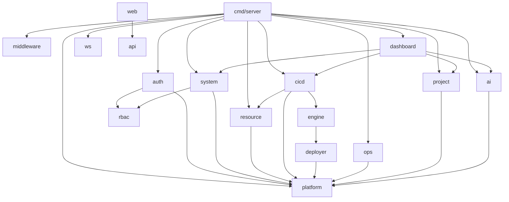

# 代码地图

## 树

```text
bedrock
├── cmd/                        # 进程入口
│   ├── server/                 # HTTP Server：DI 组装、embed web 构建产物（main.go、embed_dev/prod.go）
│   └── agent/                  # Deploy Agent（远端部署执行）
├── internal/                   # 后端业务与基础设施（Go）
│   ├── platform/               # 配置、DB、migration、seed、健康检查
│   ├── middleware/             # Gin 中间件（CORS 等）
│   ├── auth/                   # 登录、JWT / PAT、当前用户
│   ├── rbac/                   # 角色与权限判定
│   ├── system/                 # 用户、角色、字典、操作日志、权限资源（菜单/功能）
│   ├── resource/               # 仓库、服务器、凭证、访问令牌等资源
│   ├── cicd/                   # 构建任务 / 脚本任务 / 构建运行 / 流水线 API
│   ├── engine/                 # 流水线执行引擎（调度、构建、分发）
│   ├── deployer/               # 部署传输（SSH / rsync / SFTP 等）
│   ├── ops/                    # 运维：进程、开发环境等
│   ├── project/                # 项目、需求、文档
│   ├── ai/                     # AI Agent / Skill / Run
│   ├── dashboard/              # 仪表盘聚合数据
│   ├── storage/                # 制品与文件存储
│   ├── ws/                     # WebSocket
│   └── pkg/                    # 跨域公共库（加密、分页、响应信封等）
├── api/                        # HTTP 契约（Markdown，按域拆分）
├── web/                        # Vue 3 前端
│   └── src/
│       ├── api/                # 按域封装的 HTTP 客户端
│       ├── assets/             # 静态资源
│       ├── components/         # 跨页面可复用组件（含 project-select、repo-select）
│       ├── composables/        # 组合式函数（权限、面包屑等）
│       ├── content/            # 内置手册等 Markdown 内容
│       ├── lib/                # 纯工具与第三方薄封装
│       ├── pages/              # 壳层页面：登录、布局、首页
│       ├── router/             # 路由定义
│       ├── stores/             # Pinia 状态
│       ├── theme/              # 主题 token
│       └── views/              # 业务页面（按域）
│           ├── system/         # 用户、角色、权限资源、字典、操作日志
│           ├── resource/       # 仓库、服务器、凭证、令牌
│           ├── cicd/           # 构建任务 / 脚本任务 / 运行 / 流水线
│           ├── ops/            # 进程、开发环境
│           ├── projects/       # 项目、需求、文档
│           ├── ai/             # Agent / Skill / Run
│           └── help/           # 帮助手册
├── .agents/                     # 工程底座：docs 文档（.agents/docs/）、scripts 脚本、cooking
├── .githooks/                   # git 钩子（pre-commit：API 契约先行检查，make install-hooks 安装）
├── scripts/                    # 工程脚本（smoke 冒烟）
├── config.yaml                 # 本地配置（示例见 config.example.yaml）
└── Makefile                    # 构建与开发入口
```

## 模块

| 模块 | 路径 | 职责 | 主要入口 |
| --- | --- | --- | --- |
| HTTP Server | `cmd/server` | 进程入口：DI 组装、embed web 产物、启动迁移与种子 | `main.go` |
| Deploy Agent | `cmd/agent` | 远端部署执行（独立二进制） | agent main |
| platform | `internal/platform` | 配置（Viper）、DB 连接、版本化 migration、seed、健康检查 | `platform/config`、`platform/db` |
| middleware | `internal/middleware` | Gin 中间件（CORS 等） | `middleware/cors.go` |
| auth | `internal/auth` | 登录、JWT / PAT、当前用户 | `auth/handler.RegisterRoutes` |
| rbac | `internal/rbac` | 角色与权限判定 | `rbac/handler.RegisterRoutes` |
| system | `internal/system` | 用户、角色、字典、操作日志、通知、权限资源 | `system/handler.RegisterRoutes` |
| resource | `internal/resource` | 仓库、服务器、凭证、访问令牌等资源 | resource handler |
| cicd | `internal/cicd` | 构建任务/脚本任务/构建运行/流水线/Webhook API | `cicd/handler.RegisterRoutes` |
| engine | `internal/engine` | 流水线执行引擎（调度、构建、分发） | `engine/pipeline_distribute.go` 等 |
| deployer | `internal/deployer` | 部署传输（SSH / rsync / SFTP / local / agent） | deployer 包 |
| ops | `internal/ops` | 进程管理、开发环境 | ops handler |
| project | `internal/project` | 项目、需求、文档 | `project/handler.RegisterRoutes` |
| ai | `internal/ai` | AI Agent / Skill / Run | `ai/handler.RegisterRoutes` |
| dashboard | `internal/dashboard` | 仪表盘聚合数据 | `dashboard/handler.RegisterRoutes` |
| storage | `internal/storage` | 制品与文件存储 | storage 包 |
| ws | `internal/ws` | WebSocket 通道 | ws 包 |
| pkg | `internal/pkg` | 跨域公共库：加密、分页、响应信封、排序 | `pkg/response.go`、`pkg/crypto.go` |
| API 契约 | `api/` | HTTP 契约文档（按域拆分） | `api/README.md` |
| Web 前端 | `web/` | Vue 3 前端（开发态 Vite，生产 embed） | `web/src/router/index.ts`、`web/src/api/http.ts` |
| 工程脚本 | `scripts/` | 冒烟测试 | `scripts/smoke/*` |
| 文档 | `.agents/docs/` | 产品与技术文档 | `PRD.md`、`DESIGN.md`、`ops-handbook.md`、`release-checklist.md` |

## 依赖



## 关键路径

- **启动**：`cmd/server/main.go` → platform 加载配置（Viper，`BEDROCK_` 前缀）→ 连接 DB（失败拒绝启动）→ 执行未应用 migration → 首启种子超管 → DI 组装 → 注册 `/api/v1` 与 `/ws` 路由 → 提供 embed 前端静态资源
- **请求**：HTTP → middleware（CORS 等）→ 鉴权（auth：JWT / PAT）→ 权限判定（rbac）→ handler 校验 → service 编排 → repository CRUD → model（GORM）
- **构建运行**：触发（手动 / Webhook / Cron）→ cicd API → engine 调度 → 本机构建执行 → deployer 分发（rsync / sftp / scp / local / Deploy Agent）→ 制品入库（storage）
- **前端联调**：开发态 Vite 代理到后端 API；生产构建产物由 `make build` 复制进 `cmd/server/dist` 并 embed
