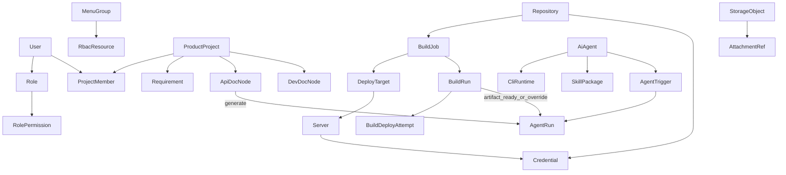

# Bedrock 2.0 详细设计

| 项 | 内容 |
| --- | --- |
| 文档版本 | 2.0.0 |
| 状态 | 已确认基线 |
| 输入 | [PRD.md](./PRD.md)、[ROADMAP.md](./ROADMAP.md)、PRD 审查 canvas、`refactor.md`、现有 1.x 代码基线 |
| 范围 | 架构、领域模型、鉴权、迁移、API、异步任务、存储、前端、测试与发布；**本文为 2.0 技术真源** |

产品需求语义以 PRD 为准；分期与 Gate 以 ROADMAP 为准；本文闭合 PRD/canvas 中未决的实现选择，并覆盖已接受风险的补偿控制。

---

## 1. 已确认决策基线

### 1.1 产品与范围

| # | 主题 | 决策 |
| --- | --- | --- |
| D1 | 交付切片 | 分阶段完成全量 2.0 GA：P0→P1→P2→P3→P4→P5（见 ROADMAP） |
| D2 | 用户角色 | 多角色；权限取**并集**；**不支持**显式 deny |
| D3 | 1.x 升级 | **仅全新安装**；不提供 1.x 数据迁移 |
| D4 | 对象 ACL 与项目归属 | **仅产品项目**使用成员 ACL（写侧）；项目域读侧：持有对应 `:view` 即可读全部项目内容。BuildJob / ScriptJob / BuildPipeline / AiAgent 可选 `project_id`（可空）。CI/CD 全局列表另受角色 `data_scope`；运维/凭证/Skills 等仍为全局 RBAC |
| D5 | 全局项目权限 | 显式 `project_projects:view_all` / `manage_all`（`view_all` 保留兼容；读侧已由 `:view` 覆盖全员可读）；普通 `:update` 不隐含全局越权；角色 `data_scope=all` 仅影响 CI/CD 等非项目域列表读 |
| D6 | AI 文档发布 | 同节点双态草稿；人工确认发布；`expected_version` 乐观锁 |
| D7 | AI CLI | Claude Code / OpenCode / Reasonix / Codex **并行**交付，均为 GA 条件 |
| D8 | 构建事件触发 Agent | 默认 `artifact_ready`；BuildJob 可覆盖为 `distribution_finished` |
| D9 | 菜单可见性 | 分组下菜单需自身 `:view`；`hidden` 菜单永不进导航；空分组不返回 |
| D10 | 系统信息 | 非超管可看与超管相同的**只读**系统信息；运维写操作仍仅超管 |
| D11 | 自定义命令 | 自定义开发环境/CLI 命令脚本：**仅超管**可维护与执行；快照 + 强提示 + 审计 |

### 1.2 运行与安全

| # | 主题 | 决策 |
| --- | --- | --- |
| D12 | 命令执行 | 构建与 AI CLI **同 Bedrock 进程 UID** 直接运行；**无 OS/容器沙箱**；产品不得声称沙箱安全 |
| D13 | Web 会话 | 允许 HTTP；`access_token` 存 **Web Storage** + Bearer；`refresh_token` 仅服务端 **Set-Cookie**（HttpOnly，不设 Secure） |
| D14 | 凭证授权时点 | **绑定/修改**时校验 `resource_credentials:use`；之后执行仅需任务 `execute` |
| D15 | Webhook | 优先平台签名头 + delivery ID 去重；保留 URL secret 兼容；日志脱敏 |
| D16 | Cron | 每任务 IANA 时区；禁止同任务重叠；停机错过的触发**跳过** |
| D17 | PAT scope | 固定白名单：`skills:read`、`agents:run`、`docs:read`、`docs:write`、`dev_docs:read`、`dev_docs:write`；前缀 `br_`+hex（不兼容旧 `br_pat_`）；SHA-256 哈希鉴权 + AES-GCM 密文（属主 `GET .../reveal` 返回密文，前端用与登录相同的 `encryption.key` 解密后复制）、可过期/吊销；**不替代 HTTPS/TLS**；供 Skill 安装器、`agents:run` 与接口/开发文档读写开放 API 对接 |
| D18 | 重启恢复 | `queued` 恢复调度；`running` → `interrupted`（可人工重试）；不做断点续跑 |
| D19 | 平台支持 | 生产：Linux amd64/arm64；macOS 仅开发；部署目标继续支持 Linux/Windows |
| D20 | 非功能验收 | **仅功能 Gate**；不设容量/延迟 SLO |

### 1.3 数据与契约

| # | 主题 | 决策 |
| --- | --- | --- |
| D21 | Build/Deploy 状态 | 归档成功后 BuildRun `status=success`；当前 `distribution_summary`；redeploy **追加** `BuildDeployAttempt` |
| D22 | DeployTarget | BuildJob **1:N 私有**；复制任务时复制配置，不跨任务共享 |
| D23 | 菜单/资源 | `MenuGroup` + `RbacResource`（菜单含展示字段；功能挂菜单）；`full_code` 鉴权 |
| D24 | Schema | 应用内版本化 Go migration + `schema_migrations`；禁止仅靠 AutoMigrate |
| D25 | DB 切换 | 改 driver 只连接目标库，**不搬迁数据** |
| D26 | API | HTTP 契约以 `api/*.md`（按域拆分的 Markdown）为真源 |
| D27 | 存储 | `StorageObject` 注册表 + `StorageService`；日志独立分段；保守默认限额 |
| D28 | 前端迁移 | 原 React `web/` 已移除；Vue 3 `web/` 为唯一 embed 源 |
| D29 | Run 快照 | 创建运行时强制写入最小配置快照（只读复现） |
| D30 | 状态字段 | `status`（结果）与 `stage`（活动阶段）分离；流水线 agent 节点为同步阶段（见 D35） |
| D31 | Agent 工作区与制品 | 每个 Agent 有一个持久根工作区与一个固定 `output_dir` 产出目录，跨 Run 复用且不清空根目录与产出目录；Run **成功**时将产出目录快照打 zip 绑定到该 AgentRun（`artifact_path`），可供下载；空目录不归档；归档失败不阻断 Run 成功态；BuildRun 制品能力不变 |
| D32 | BuildJob 工作区路径 | 每个构建任务 checkout 目录为 `{workspace}/jobs/job-{id}/`（对齐 Agent `agents/agent-{id}/`）；API 只读回显绝对路径 `workspace_path`；不自动搬迁旧 `repo-*/job-*` 目录 |
| D33 | ScriptJob | 无仓库/制品/部署的精简任务；工作区 `{workspace}/scripts/script-{id}/`；日志 `{log_dir}/script-{jobID}/run-{NNN}.log`；触发同 BuildJob（manual/cron/webhook，webhook 无分支匹配）；脚本执行前 `${{...}}` 替换 |
| D34 | 脚本模板 `${{...}}` | 构建/构建后脚本执行前一次性文本替换；内置 `job.*` / `run.*` / `workspace`；用户变量 `${{ env.KEY }}`；未知变量失败；不二次展开 |
| D35 | 构建流水线 | 独立 `BuildPipeline` 模块；VueFlow `graph_json` DAG（v2：start/end/buildJob/scriptJob/agent 节点，边带 `on_success`/`on_failure`/`always` 条件）；任务节点 AND-join（前驱全部终态且各有匹配入边才触发，否则 skipped 传播）；**到达任意 end 节点即 success**（OR-join，取消在飞分支），静止未到 end 则 failed；agent 节点**同步**等待 AgentRun 并按结果走分支；节点级 env 覆盖（AES-GCM 存于 graph_json，run > job）；**无**跨任务制品传递 |

### 1.4 已接受风险（必须对外声明）

1. **同 UID 执行**：获得脚本/Agent/自定义命令执行权的用户，可触及 Bedrock 进程可见的文件、环境变量与已注入凭证。RBAC/ACL **不能**替代 OS 隔离。
2. **HTTP + 浏览器会话存储**：`access_token`（Web Storage）与响应可能被窃听或被同机恶意脚本读取；`refresh_token` 为 HttpOnly Cookie（不设 Secure，HTTP 下仍可能被网络窃听）；`password_cipher` **不替代** TLS。

补偿控制：超管门控运维与自定义命令；脚本/开发环境编辑权限收紧；审计；生产强烈建议 HTTPS；登录页与文档说明风险边界。

---

## 2. 部署形态与支持矩阵

```text
┌─────────────────────────────────────────────┐
│  Bedrock Server（单体二进制）                 │
│  - Go API / WS / Scheduler / Cron             │
│  - web 产物 embed                          │
│  - 本机构建 + 本机 AI CLI                     │
│  - 本地工作区 / 制品 / 日志 / 缓存 / 对象存储目录 │
└──────────────────────┬──────────────────────┘
                       │ rsync / sftp / scp / agent / local
                       ▼
┌─────────────────────────────────────────────┐
│  目标服务器 + 可选 Deploy Agent（独立二进制） │
└─────────────────────────────────────────────┘
```

| 组件 | 支持 |
| --- | --- |
| Server 生产 | Linux amd64、Linux arm64 |
| Server 开发 | macOS（不承诺生产特性如全部开发环境安装路径） |
| Deploy Agent / 远程目标 | Linux、Windows（沿用现有部署器能力） |
| 数据库 | sqlite（默认）、postgres/postgresql、mysql |
| 前端发布 | embed 进 Server；开发态 Vite 代理 |

---

## 3. 后端包结构与分层

### 3.1 目标目录

```text
cmd/
  server/                 # 瘦入口：配置、migration、DI、路由装配、embed
  agent/                  # Deploy Agent（独立）
internal/
  platform/               # config、db 工厂、migration runner、健康检查
  auth/                   # JWT、login cipher、PAT 校验（PAT CRUD 属 resource）
  rbac/                   # 资源树、权限合并、中间件
  system/                 # User、Role、Dictionary、OperationLog、Menu 维护
  resource/               # Repository、Server、Credential、CliRuntime、PAT（共享资源）
  cicd/                   # BuildJob、BuildRun、Webhook
  engine/                 # Pipeline、Scheduler、Cron、Git（依赖 cicd / resource 接口）
  deployer/               # rsync/sftp/scp/agent/local
  ops/                    # Process、DevEnvironment
  project/                # ProductProject、Requirement、ApiDoc
  ai/                     # AiAgent、AgentRun、Skill（CLI 查找依赖 resource 注入）
  dashboard/              # Layout + 卡片数据源
  storage/                # StorageObject + StorageService
  ws/                     # Hub + 频道
  pkg/                    # response、crypto、errors、id
api/                      # HTTP 契约（Markdown，按域拆分）
  README.md / auth.md / system.md / resource.md / cicd.md / ops.md / project.md / ai.md
web/                      # Vue 3 前端
docs/
  PRD.md / DESIGN.md / ROADMAP.md
```

### 3.2 分层规则

`handler → service → repository → model`，单向依赖，禁止跨层调用。

- **model**：结构 + GORM tag；无业务逻辑。
- **repository**：`Find/Create/Update/Delete/List/Count`；`New*Repository(db)`。
- **service**：编排；可组合多 repository / storage / engine 端口。
- **handler**：解析、校验、调用 service、统一响应；`RegisterRoutes(rg)`。
- **DI**：`cmd/server` 手动组装；按域注册路由，避免巨型 `main` 路由墙。

### 3.3 可复用与重写边界

| 复用（适配） | 重写 / 新建 |
| --- | --- |
| Pipeline 阶段语义、Deployer 五法、Git、Webhook 解析器、WS 日志模式、AES-GCM、Deploy Agent | 动态 RBAC、多库工厂、版本化 migration、Repository/BuildJob 拆分、AgentRun 异步、PM 域、Skills/PAT、StorageObject、web |

---

## 4. 身份、RBAC 与项目 ACL

### 4.1 身份模型

- **User**：可禁用；绑定 **多个 Role**；权限 = 各角色权限码并集。
- **Super Admin**：`users.is_super_admin` 为鉴权真源；内置角色 `code=super_admin`（`type=builtin`）与唯一超管用户 1:1 同步；不可删、不可改权限、不可通过用户角色绑定 API 赋给他人。
- **自定义 Role**：`type=custom`；绑定功能 `full_code` 集合。
- **PAT**：属于 User；scope ⊆ {`skills:read`,`agents:run`,`docs:read`,`docs:write`,`dev_docs:read`,`dev_docs:write`}；明文前缀 `br_`+hex；存 SHA-256 哈希（鉴权）与 AES-GCM 密文（属主 `GET .../reveal` 返回密文，前端解密）；列表仅元数据 + `copyable`；历史无密文不可复制。

### 4.2 权限码

格式：`{menu_code}:{feature_code}`（`full_code`），整串仅一个 `:`；菜单 `code` **不含 `.`**（旧 path 中的 `.` 已改为 `_`，如 `system.users:view` → `system_users:view`）。

常用 feature code：`view`、`create`、`update`、`delete`、`execute`、`download`、`use`、`view_all`、`manage_all` 等。

### 4.3 菜单与资源真源

```text
MenuGroup (name, code, route_prefix, sort_key, enabled)
RbacResource
  menu  : code=full_code, group_id, title/route/icon_*, hidden, super_admin_only
  feature (action|card): full_code={menu.code}:{code}, parent_id→menu, super_admin_only
```

- 登录 / `GET /auth/me` 返回两层菜单（分组 → 菜单项），对齐侧栏 `u-group-nav`；过滤 `hidden`、未启用、非超管的 `super_admin_only`，且需具备 `{menuCode}:view`。
- 前端**只渲染**下发菜单，不硬编码全量再隐藏。
- 图标：原始体积 ≤ 32KB；超限 400。
- `super_admin_only`：服务端拒绝写入角色权限；生效时非超管一律拒绝（不再硬编码 `ops` 前缀）。

### 4.4 项目 ACL 与角色数据权限

| 项目角色 | 能力 |
| --- | --- |
| Owner | 项目内全部管理；转让；归档/解散（仍受全局 RBAC） |
| Admin | 管理成员（除转让 Owner）、需求与文档 |
| Member | 按细则创建/编辑需求与文档、评论 |
| Readonly | 只读 |

角色级字段 `data_scope`：`self` | `all`。多角色取**最宽**（任一为 `all` 或超管 → 有效范围为 `all`）。新建角色默认 `self`；已有角色 migration 置 `all`（避免 CI/CD 行为突变）。`data_scope` **不再**用于过滤产品项目列表。

项目鉴权公式：

```text
允许 = 全局功能权限(full_code)
     AND (
           超管
        OR（读侧）全局权限已通过 → 放行项目域读
        OR 持有 project_projects:manage_all（写/管理）
        OR 是项目成员且项目角色允许该动作
        OR（CI/CD 全局列表读侧）data_scope=all
           或 created_by=自己 或 is_public
        OR（Skill 读侧）visibility=public 或 created_by=自己 或 data_scope=all
         )
```

- **项目域读**：持有 `project_projects:view`（及子域 `:view`）即可列出/查看全部项目及相关读接口；**不**要求成员身份。非成员 `my_role` 为空，`permissions` 能力位全 false。
- **项目域写**：仍需成员角色允许，或 `manage_all` / 超管；普通 `:update` **不**隐含全局越权。
- `manage_all`：可管理全部项目成员与内容，**无需**加入项目。
- Owner 转让：仅当前 Owner 或 `manage_all`。
- **`ProductProject.is_public`**：字段保留兼容，**不再影响**项目读可见性；写、成员管理不因该字段放宽。
- **对象级成员 ACL**：仅产品项目（`ProductProject` / 成员）的**写**路径。
- **CI/CD**：无成员表；可选 `project_id` 归属项目。全局列表（不带 `project_id`）在 `data_scope=self` 时可见 `created_by=自己` 或 `is_public`；BuildRun / ScriptRun / PipelineRun 跟随 Job/Pipeline。列表带 `?project_id=` 时跳过上述数据范围过滤（仍需各域 `:view`）。**写/执行**仍仅本人（`data_scope=self`）或 `data_scope=all` / 超管，不因项目归属放宽。
- **AI Agent**：可选 `project_id`；列表可按项目过滤。Skills **不**绑定项目；列表/详情遵循 `data_scope=all OR visibility=public OR created_by=自己`；改删仍仅创建者/超管。运维、凭证等域仍为全局 RBAC only。
- **安全边界**：上述规则是应用层授权，**不是** OS/租户隔离；同 UID 执行与凭证注入边界见 §1.2 / 安全表述。

### 4.5 凭证与服务器认证

- 凭证密文 AES-GCM；API 永不回显明文。
- 引用绑定（仓库认证、Deploy Agent 凭证、任务变量等）时校验操作者 `resource_credentials:use`。
- 服务器认证：`password` 表单直填，AES-GCM 存 `servers.password_cipher`（响应仅 `has_password`）；`ssh_key` 不入库私钥，使用运行 Bedrock 主机上的 `SSH_AUTH_SOCK` / ssh-agent；仅 `auth_type=agent` 绑定 `agent_credential_id`。
- Cron/Webhook 执行使用绑定快照；不要求「触发者」现场具备 `use`。
- 删除保护：仍被引用时拦截并提示。

### 4.6 认证流

| 机制 | 规则 |
| --- | --- |
| Web JWT | access 短 TTL（Web Storage + Bearer）；refresh 长 TTL（HttpOnly Cookie，不设 Secure）；401 → `/auth/refresh` → 重试 |
| 登录 | 仅接受 `password_cipher`（前端）；服务端亦可兼容明文 `password` 供调试，但 web **禁止**提交明文 |
| Refresh | `/auth/refresh` 读 Cookie（可选 body 兜底）；失败清会话并跳转登录 |
| PAT | `Authorization: Bearer <pat>`；与 JWT 分流校验；按 scope 映射端点 |
| Webhook | 无 Bearer；见 §8 |
| WS | query `token`（JWT）；生产建议 HTTPS 以降低日志泄露面 |

**不提供**：refresh rotation 作为首期必做（可后续增强）；但用户禁用后，后续请求必须失败（校验时查库 `disabled`）。

---

## 5. 核心领域模型

### 5.1 实体关系（概念）



### 5.2 CI/CD 状态机

**BuildRun.status**（结果）：`queued` | `running` | `success` | `failed` | `cancelled` | `interrupted`

**BuildRun.stage**（活动）：`pending` | `cloning` | `building` | `archiving` | `distributing` | `idle`

规则：

1. 克隆→构建（含可选 `post_build_script`）→缓存保存→归档成功后：`status=success`，制品可下载；`stage` 进入 `distributing` 或 `idle`。`post_build_script` 在主构建脚本成功之后、缓存保存/归档之前执行（与主脚本同一 shell 类型、cwd=`work_dir`、同一套环境变量）；失败与主构建同级 → `failed`。
2. **分发失败不将 `status` 改为 `failed`**；更新 `distribution_summary`：`none` | `running` | `all_success` | `partial` | `all_failed` | `cancelled`。
3. 构建阶段失败 → `failed`；用户取消构建中 → `cancelled`；若已 `success` 仅取消分发 → 保持 `success` + summary 反映取消。`work_dir` 解析后的构建目录在启动脚本前校验：不存在/非目录时明确失败原因，避免误报为缺少 `sh`。
4. 流水线 agent 节点为**同步**阶段（orchestrator 等待 AgentRun 终态并按边条件走分支）；构建事件（`agent_ids`/`agent_trigger_event`/`AgentTrigger`）仍**异步**创建独立 AgentRun，Agent 失败**不**修改 BuildRun.status。
5. `retry`：新建 BuildRun；`redeploy`：**同一** BuildRun，追加 `BuildDeployAttempt`，summary 指向最新一批结果。

**工作区路径**：BuildJob checkout 为 `{workspace}/jobs/job-{id}/`（持久复用，跨 Run；对齐 Agent `{workspace}/agents/agent-{id}/`）。API 只读字段 `workspace_path` 为绝对路径。首次在新路径 clone；旧目录 `repo-{repository_id}/job-{id}/` **不**自动搬迁，可手工清理。日志 / 制品 / 缓存仍按 `job-{id}` 隔离（无 repo 前缀）。

**脚本任务（ScriptJob）**：无 clone / 归档 / 分发；工作区 `{workspace}/scripts/script-{id}/`（跨 run 复用、不清空）；日志 `{log_dir}/script-{jobID}/run-{NNN}.log`。执行流：enqueue → `${{...}}` 替换 → 跑脚本 → 终态。Webhook 仅 URL secret + delivery 去重，不做分支匹配。

**脚本模板**：`build_script` / `post_build_script` / ScriptJob `script` 启动前对 `${{ path }}` 做一次性文本替换（非 shell 求值）。构建内置只读：`job.id`、`job.name`、`run.id`、`run.build_number`、`run.branch`、`run.commit`、`workspace`；脚本任务内置：`job.id`、`job.name`、`run.id`、`workspace`。用户变量 `${{ env.KEY }}` 对齐 `env_var_names` + `env_vars`（同名以 Key-Value 为准），进程环境仍注入以兼容 `$KEY`。未知变量 → `failed`；替换值不二次展开。

**制品路径（`artifact_paths`）**：相对仓库根的文件/目录列表（替代单一 `output_dir`；`output_dir` 列保留一版兼容，读时与 `artifact_paths` 合并）。运行时在 clone 根下解析并做边界校验；配置路径缺失 → 构建 `failed`。归档规则：0 路径无制品（有部署目标时拒绝整仓分发，`distribution_summary=all_failed`）；1 文件原样存储（`artifact_kind=file`）；1 目录按 `artifact_format` 打 zip/tar.gz（`archive`）；2+ 路径按 basename 合并后打一包（`bundle`，basename 冲突失败）。分发与 redeploy 均从同一 `deployRoot` 出发（文件/归档先物化到 staging）。

**分发**：rsync 默认 merge（覆盖制品文件，不删远端多余文件）；DeployTarget.`mirror=true` 时加 `--delete` 镜像同步。post-deploy 与 rsync/scp 等 CLI 分发共用系统 `ssh`/`sshpass` 与主机 `~/.ssh` 认证（`auth_type=agent` 仍走 HTTP）。

**构建环境变量（混合）**：`env_var_names`（JSON 文本列，仅名称，运行时 `os.LookupEnv`）+ `env_vars_cipher`（AES-GCM Key-Value）。API 对 Key-Value 仅回显 `{key, has_value}`，不回显明文。运行时合并：`os.Environ()` → 名称列表注入 → 解密后的 Key-Value（同名以任务 Key-Value 覆盖）。

**BuildDeployAttempt**：每次分发/重新分发对每个目标一行（或一批次 + 每目标行）；含目标配置快照、状态、日志引用、起止时间。

**最小快照（BuildRun.snapshot_json）** 至少含：trigger 载荷、resolved commit、脚本 SHA-256、`env_var_names`、Key-Value 的 **key 列表**（`env_var_keys`，无明文值）、`artifact_paths`、DeployTarget 副本、制品格式、触发者/系统主体。

### 5.3 AgentRun / 安装任务

| 任务 | status | 重启 |
| --- | --- | --- |
| AgentRun | pending/queued/running/success/failed/cancelled/interrupted | queued 恢复；running→interrupted；重试建议**新 Run** |
| DevEnvJob | 同上 | running→interrupted/failed，保留日志；人工重试新任务 |
| CLI 安装/升级/卸载 | — | **同步**在请求内执行；结果一次性返回（不落库、不保留历史任务） |

构建事件默认：`artifact_ready`（归档成功且制品路径有效）。BuildJob.`agent_trigger_event` 可覆盖为 `distribution_finished`（本轮分发流程结束，无论成功失败）或 `none`。可选 `agent_ids` 绑定一个或多个智能体；亦可在 AgentTrigger 中按 Job 过滤。事件**异步**创建独立 AgentRun；Agent 失败**不**修改 BuildRun.status。流水线 agent 节点的同步语义见 D35，与该异步机制解耦。

Agent 工作区与记录规则：

1. 每个 Agent 的唯一执行目录为 `{workspace}/agents/agent-{id}/`。同一 Agent 的所有 Run 直接复用该持久根工作区，开始新 Run 时不清空根目录已有文件；不同 Agent 以各自根目录为边界。
2. 工作区代码绑定为多组 `{repository_id, branch}`（同 Agent 内 `(repository_id, branch)` 唯一；checkout 目录为 `repo-{repository_id}-{sanitizedBranch}/`）。创建/更新 Agent 后将 `workspace_status` 置为 `pending` 并**异步**初始化工作区（技能注入 + `GitCloneOrPull` checkout）；成功 → `ready`，失败 → `failed`（写入 `workspace_error`，不回滚删除配置）。仅 `workspace_status=ready` 时可创建 Run（手动 / API / cron / 构建事件）。每次 Run 执行前仍增量同步绑定分支。不再软链构建任务 `job-*` 工作区。分支存在性保存时不校验。
3. 每个 Agent 另有一个固定产出目录 `{agentRoot}/{output_dir}`（配置字段 `output_dir`，默认相对名 `output`）。CLI 注入 `BEDROCK_AGENT_WORKDIR`（根）与 `BEDROCK_AGENT_OUTPUT`（固定产出目录）。不创建 `runs/run-{id}/output` 或任何 per-run 输出子目录；后续 Run 复用同一产出目录且不清空既有内容（便于缓存与增量写入），由 Agent/CLI 自行覆盖需要更新的文件。
4. Agent 环境变量 AES-GCM 加密存储（`env_vars_cipher`）；API 不回显明文。Sync/Run 时解密写入工作区 `.env` 并注入进程环境（`BEDROCK_AGENT_ENV_FILE` 指向该文件）；同 UID 下明文可见。
5. AgentRun 成功时将 `{agentRoot}/{output_dir}` 快照归档为 `{artifact_dir}/agent-{id}/run-{runID}.zip`，写入 `artifact_path`（`artifact_kind=archive`）；产出目录无常规文件则跳过归档；归档失败只记日志，不改变 Run 成功态。`GET /ai/runs/:id/artifact`（`ai_runs:view`）以附件流式返回。删除 Agent 时级联删除其 Run 记录并清理对应归档目录。
6. 上述 AgentRun 快照归档与 CI/CD BuildRun 制品（§5.2）相互独立。
7. 构建事件触发（`AgentTrigger.build_event` / `BuildJob.agent_ids`）与上述仓库绑定解耦，语义不变。

### 5.4 文档节点

```text
ApiDocNode:
  content               # Markdown 正文（无草稿/发布分态、无版本号）
  draft_source_run_id   # 可选，关联生成该内容的 AgentRun

DevDocNode:
  content               # Markdown 正文（结构对齐 ApiDocNode，无 AI 生成）
```

- 创建/更新/导入/开放 push：直接写 `content`。
- `GET .../docs/pull`：按路径读取接口文档（开放 API，PAT `docs:read`）。
- `GET .../dev-docs/pull`：按路径读取开发文档（开放 API，PAT `dev_docs:read`）；push/export 字段为 `doc_dir` / `doc_name` / `content`。
- `POST .../docs/generate` 契约归属项目管理域；接通 `AgentRun` 见 **P4**。成功后写入 `content`。开发文档无 generate。

### 5.5 Skill 可见性

- `public`：具备 Skills 查看权限的用户可见/可用。
- `private`：仅创建者（及后续若扩展的显式授权——首期不做对象 ACL）可见。
- 更新覆盖当前包，不保留历史版本；Run 快照保存 package digest。

---

## 6. 数据库与 Migration

### 6.1 配置

```yaml
database:
  driver: sqlite # sqlite | postgres | mysql
  path: ./data/db.sqlite
  host: 127.0.0.1
  port: 5432
  name: bedrock
  user: bedrock
  password: "***"
  ssl_mode: disable
  max_open_conns: 25
  max_idle_conns: 5
  conn_max_lifetime: 1h
```

### 6.2 Migration 机制

- 表 `schema_migrations(version TEXT PRIMARY KEY, applied_at TIMESTAMP)`。
- Go 注册表：`migrations.Register(version, up func(ctx, db, driver))`。
- 启动时事务顺序执行未应用版本；失败拒绝启动。
- 公共 GORM/SQL 操作 + **少量驱动分支**（如部分索引类型）。
- **禁止**把业务数据转换塞进日常启动；2.0 无 1.x 迁移任务。
- 合同测试：同一套 repository 用例在 sqlite/postgres/mysql 上跑。

### 6.3 切换语义

修改 `driver` 并重启 = 连接**另一空库或已有 2.0 库**；不会从 SQLite「搬家」到 Postgres。产品文案与启动日志必须写明。

### 6.4 旧 Agent 运行目录与归档清理

从带有旧 Agent 单 Run 输出/归档能力的 2.0 版本升级时，必须在迁移前完整备份数据库、工作区与制品目录。升级清理只处理以下旧数据：

- `{workspace}/agents/agent-{id}/runs/`
- Agent 归档根下的 `agent-{id}/run-{runID}.zip` 与 `agent-{id}/run-{runID}.tar.gz`

清理采用可恢复的隔离流程：严格校验目标位于预期根目录内且路径祖先不是软链，将旧路径原子移入同一文件系统的隔离区；数据库 schema 迁移提交后再删除隔离区。任一路径越界、校验、移动或删除失败都拒绝升级，并允许下次启动幂等续做。

该流程绝不删除 `{workspace}/agents/agent-{id}/` 根目录中的其他文件，也不触碰 BuildRun 工作区或制品。这里描述的是 2.0 内部版本升级，不构成 1.x → 2.0 数据迁移支持。

---

## 7. API 契约

### 7.1 约定

| 项 | 规则 |
| --- | --- |
| 前缀 | `/api/v1` |
| 成功 | `{ "code": 0, "message": "success", "data": ... }` |
| 错误 | `{ "code": <http或业务码>, "message": "...", "request_id": "..." }` |
| 分页 | `{ items, total, page, page_size, total_pages }`；稳定排序默认 `id desc` 或文档约定字段 |
| 异步创建 | `202` + `{ id, status }`；随后查详情/WS |
| 幂等 | 写接口支持 `Idempotency-Key`（Webhook delivery、手动触发等） |
| 并发 | 文档发布等使用 `expected_version` / `If-Match` |
| 鉴权 | `Authorization: Bearer <jwt\|pat>` |
| 契约源 | `api/*.md`（按域拆分）；前后端对照契约文档实现；行为级保障见 `make smoke-api-e2e` |

### 7.2 错误码基线

| HTTP | 场景 |
| --- | --- |
| 400 | 参数/JSON/登录 cipher 无效 |
| 401 | 未认证、密钥错误、PAT 无效 |
| 403 | RBAC/ACL/超管门控/PAT scope |
| 404 | 资源不存在 |
| 409 | 版本冲突、状态不允许、引用冲突 |
| 422 | 语义校验失败（如缺 SKILL.md） |
| 429 | 限流（可选，首期可占位） |
| 500/503 | 内部错误/依赖不可用 |

### 7.3 路由域（与 PRD 对齐，实现以 `api/*.md` 为准）

- Auth / Users / Roles / RBAC resources / Menus / Dictionaries / Operation logs / Tokens
- Dashboard layout + card data
- Ops processes / dev-environments / per-environment sources
- Resource: repositories / servers / credentials
- CI/CD: webhook / build-jobs / build-runs / build-pipelines / pipeline-runs
- Projects / members / requirements / docs（含 generate、publish、diff）
- AI CLIs / agents / triggers / runs / skills

Webhook 路径（2.0）：`POST /api/v1/webhook/jobs/:build_job_id/:secret`。旧仓库级路径 `POST /api/v1/webhook/repos/:repository_id/:secret` 返回 410 Gone。

---

## 8. Webhook 与 Cron

### 8.1 Webhook

校验顺序：

1. 解析 BuildJob + URL secret（恒需匹配，作为第一道门或与签名并用）。
2. 若存在平台签名头（GitHub/GitLab/Gitea/Gitee/Bitbucket 等），**校验签名**；失败 401。
3. 使用 delivery ID（或平台等价唯一键）做幂等；重复投递返回成功且不重复触发。
4. 无签名的 generic/手动调用：允许仅 URL secret；必须审计并限流。
5. 日志与错误信息**脱敏** secret。

分支匹配：与 BuildJob 分支规则一致；每个 BuildJob 拥有独立 Webhook URL 与 secret。

### 8.2 Cron

- 表达式 + **每任务** `timezone`（IANA）。
- 同 Job 若上一次 Run 仍非终态 → **跳过**本次触发并记审计/指标。
- 服务停机期间错过的触发：**不补跑**。
- 与全局 `max_concurrent` 队列协同：触发成功仅表示入队。

---

## 9. 异步任务与调度

```text
API/Cron/Webhook/Event
        │
        ▼
   持久化 Run 行 (queued)
        │
        ▼
   内存 Scheduler（可配置并发）
        │
        ▼
   Executor (engine / ai / ops install)
```

| 策略 | 行为 |
| --- | --- |
| 入队 | DB 先写 queued，再投递 channel |
| 重启 | 扫描：queued 重新 Submit；running → interrupted |
| 取消 | cancel map + context；终态写库 |
| 并发 | `build.max_concurrent`；Agent/安装可共用或分池（配置项） |
| 通知 | 终态站内通知 + WS |

---

## 10. 存储设计

### 10.1 StorageObject

| 字段（概念） | 说明 |
| --- | --- |
| id | 主键 |
| kind | attachment / doc_import / skill_zip / artifact / other；`artifact` 仅用于 BuildRun 等支持制品的域，不用于 AgentRun |
| sha256 | 内容摘要 |
| size | 字节 |
| content_type | MIME |
| path | 相对存储根路径 |
| ref_count / refs | 引用保护 |
| created_by | 上传者 |
| deleted_at | 软删 |
| purge_after | GC 时间 |

日志与构建实时日志：**不**强制进对象表，按 `{log_dir}/...` 分段文件 + 保留期清理。

本地目录约定（`build.workspace_dir` 等）：

| 路径 | 用途 |
| --- | --- |
| `{workspace}/jobs/job-{id}/` | BuildJob Git checkout（跨 Run 复用） |
| `{workspace}/scripts/script-{id}/` | ScriptJob 工作区（跨 Run 复用） |
| `{workspace}/agents/agent-{id}/` | Agent 持久根工作区 |
| `{artifact_dir}/job-{id}/` | BuildRun 制品 |
| `{artifact_dir}/agent-{id}/run-{runID}.zip` | AgentRun 成功时的产出目录快照归档 |
| `{log_dir}/job-{id}/` | BuildRun 日志 |
| `{log_dir}/script-{jobID}/` | ScriptRun 日志 |
| `{cache_dir}/job-{id}/` | 构建缓存 |

### 10.2 默认限额（均可配置）

| 类型 | 默认 |
| --- | --- |
| 附件 | 20MB |
| 文档导入包 | 100MB |
| Skill ZIP | 50MB |
| 制品单件 | 5GB |
| 日志保留 | 30 天 |
| 临时工作区保留 | 7 天（终态后）；不适用于跨 Run 持续复用的 Agent 根工作区 |
| 软删后 GC | 24 小时 |

### 10.3 安全

- 上传：大小、MIME/扩展名白名单（按 kind）、ZIP 条目数/解压比限制、防 Zip Slip。
- Markdown 渲染：XSS 消毒（前端强制；后端存储原样但 API 可标记）。
- 路径：一律经 StorageService，禁止业务直接拼接用户输入路径。

---

## 11. 前端设计（web）

### 11.1 技术栈

| 层 | 技术 |
| --- | --- |
| 框架 | Vue 3.5+（Composition API + SFC） |
| 语言 | TypeScript |
| 状态 | Pinia |
| 路由 | Vue Router |
| 构建 | Vite+（`vite-plus` / `vp`） |
| UI | `@veltra/desktop` + `@veltra/styles` + `@veltra/icons` + `@veltra/utils` + `@veltra/directives` + `@veltra/compositions` |
| 工具 | `@cat-kit/core`、`@cat-kit/fe`、`@cat-kit/http`、`@cat-kit/tsconfig` |
| 包管理 | bun（由 Vite+ 工作流包装） |

### 11.2 目录

```text
web/src/
  main.ts
  App.vue
  router/
  stores/          # auth, notification, ...
  api/             # @cat-kit/http 客户端 + 生成类型
  composables/     # usePermission, useWebSocket, ...
  layouts/
  components/
  views/           # 按域：resource, cicd, project, ai, ops, system, dashboard
  lib/             # constants, login-crypto, ...
```

### 11.3 关键规则

1. UI **优先** Veltra；无合适组件再自建。
2. HTTP **只**经统一 client；401 refresh 语义对齐 DESIGN。
3. 两层分组菜单与功能 `full_code` 来自 `/auth/me`；侧栏 `u-group-nav`；路由守卫 + 按钮级 `hasPermission`。
4. 登录仅 `password_cipher`；密钥：`window.__BEDROCK_ENCRYPTION_KEY__` > env。PAT reveal 返回 AES-GCM 密文，前端用同一密钥解密（不夸大隔离：密钥本就注入浏览器）。
5. 避免巨型 SFC（参考 vue-best-practices）；重型编辑器/终端可局部引入。
6. 开发端口代理 `/api`、`/ws` → `:8080`；embed 仍输出到构建产物并由 Go 注入加密密钥。

### 11.4 切换

- Makefile `FRONTEND_DIR ?= web`（CI/Release 默认相同）。
- Go embed **只认** `cmd/server/dist`，不关心来源。
- Release：构建 `web/dist` → 拷贝至 `cmd/server/dist` → `go build` embed。
- 回滚：替换 `cmd/server/dist` 或检出上一发布 tag 产物后重打包。见 [release-checklist.md](./release-checklist.md)。
- 切换 Gate 证据：[roadmap/P5-switch-gate.md](./roadmap/P5-switch-gate.md)；Gate 条文见 ROADMAP P5。

---

## 12. 可观测、审计与通知

- **OperationLog**：写操作与关键安全事件（谁、何时、IP、action、资源、结果、详情）。
- **构建/Agent 日志**：文件 + WS 频道 `build_run:{id}` / `agent_run:{id}`。
- **通知**：终态推送；WS `notifications:{userId}`。
- **request_id**：中间件注入，错误响应回传。

---

## 13. 测试与验收策略

| 层级 | 内容 |
| --- | --- |
| 单元 | migration、旧 Agent 目录/归档安全清理、权限合并、状态机、签名校验、存储路径安全 |
| 合同 | 三数据库 repository；契约文档中的响应形状 |
| 集成 | Pipeline 分发失败、redeploy attempt、重启恢复、Webhook 幂等 |
| E2E | Playwright 冒烟：登录→菜单→构建→日志→（GA）Agent/文档发布 |
| 平台 | Linux amd64/arm64 发布包冒烟；macOS 开发路径 |
| 明确不做 | 容量压测、延迟 SLO |

功能验收对齐 PRD 模块清单，但行为以本文决策为准（例如 view_all、草稿发布、attempt 历史）。

---

## 14. 发布、备份与回滚

1. **发布物**：`bedrock` Server 单二进制（embed 前端）+ `bedrock-agent`；Linux amd64/arm64 命名 `bedrock-linux-amd64` / `bedrock-linux-arm64` 与对应 `bedrock-agent-*`；附带 SHA256。
2. **全新安装**：空数据目录 + 配置 + 启动（migration + 种子超管）。见 [ops-handbook.md](./ops-handbook.md)。
3. **备份**：SQLite 可用文件复制/专用备份命令；Postgres/MySQL 使用各自工具——平台可提供「备份指引」，**不假装统一物理备份**。
4. **前端回滚**：保留上一版 `web` 产物 tag；替换 `cmd/server/dist` 后重打包。见 [release-checklist.md](./release-checklist.md)。
5. **无** 1.x 升级通道；文档与登录页显著位置声明。
6. **2.0 内部升级**：若来源版本仍有旧 Agent `runs/` 与归档，升级会按 §6.4 安全清理；操作前必须备份数据库、工作区与制品目录。
7. **检查单**：[release-checklist.md](./release-checklist.md)；冒烟：`make smoke*`。

---

## 15. 与 1.x 概念映射（无数据迁移）

| 1.x | 2.0 |
| --- | --- |
| Project | Repository（+ 可选关联 ProductProject） |
| Environment | BuildJob + DeployTarget[] |
| Build | BuildRun |
| BuildDistribution | BuildDeployAttempt（可多轮历史） |
| 固定 admin/ops/dev | Super Admin + 自定义 Role |
| 内嵌 pipeline agent | 异步 AgentRun + 构建事件；流水线 agent 节点（同步，见 D35） |
| AgentProxy | CliRuntime |
| React web/（已移除） | Vue web/ |

---

## 16. 文档关系

| 文档 | 职责 |
| --- | --- |
| PRD.md | 产品需求与验收意图 |
| ROADMAP.md | 分期、依赖、Gate |
| DESIGN.md | 技术真源（本文） |
| AGENTS.md | 命令、目录与读写指引；FE/BE 约定见 `.agents/fe.md` / `.agents/be.md` |
| ops-handbook.md | 安装、多库、备份、风险、回滚 |
| release-checklist.md | 发版检查与 checksum |
| known-issues.md | 非阻塞已知问题 |
| api/*.md | API 真源（按域拆分） |

冲突时：实现与 `api/*.md` / DESIGN 对齐；需求争议回退 PRD，并开变更同步文档。

---

**文档结束。**
